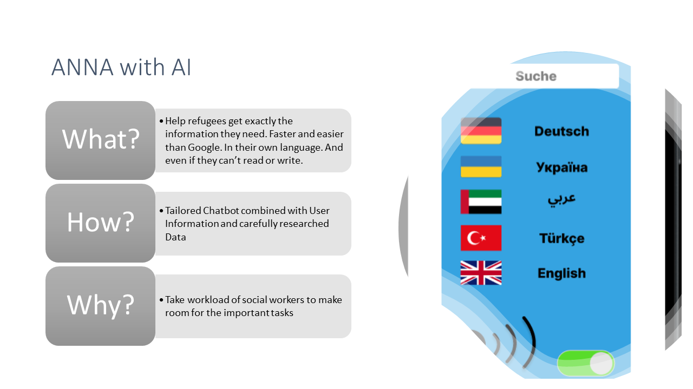

# Project ANNA by Team 6

## ANNA is your personal guide, leading the way through the infomartion jungle.

Welcome, we are very happy that you are visiting our GitHub page. Our App "ANNA" will assist you in answering your questions. Have fun!  

## The challenge giver

[Bavarian Red Cross (BRK)](https://www.brk.de/)

## The problem
Refugees face significant challenges in accessing vital information and support during the resettlement process. Language barriers, limited resources, and a shortage of social workers create obstacles that hinder their ability to navigate their new environment effectively. This information gap delays their integration, jeopardizing crucial milestones such as finding housing, employment, and essential services. A reliable and accessible solution is needed to bridge this gap and provide refugees with instant access to the information they need for a successful resettlement.

## The solution
ANNA is a mobile application that addresses the information and support gap for refugees during the resettlement process. By offering a user-friendly platform available in over 95 languages, ANNA provides refugees with instant access to accurate and practical information tailored to their specific needs. The app provides comprehensive support, including forms, addresses, tips, and tricks, all presented in a concise and easily understandable manner. With the addition of a speech function, ANNA enables voice interactions, enhancing accessibility and usability. By equipping refugees with the necessary resources and guidance, ANNA streamlines the integration process and empowers refugees to navigate their new environment with ease.

## Why ANNA

The key features:
- Accessible navigation in over 95 languages
- Comprehensive support, including forms, addresses, tips, and tricks
- Advanced AI engine for accurate and concise answers
- Speech function for voice interactions
- User-friendly interface for easy navigation
- Data-driven approach for up-to-date information

## Test ANNA

Feel free to test [ANNA](https://www.figma.com/proto/XbzkLkKWHi29msgiZa1eYH/Prototype?type=design&node-id=1-173&scaling=scale-down&page-id=0%3A1&starting-point-node-id=1%3A159) on your own.

## Our GitHub Wiki 

[Github Wiki](https://github.com/Real-Projects-Digitalization/ANNA-Team-6-SS23-/wiki)

## Our GitHub page

[GitHub Page](https://real-projects-digitalization.github.io/ANNA-Team-6-SS23-/)

